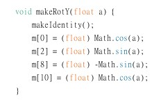
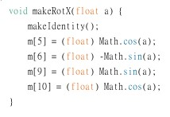
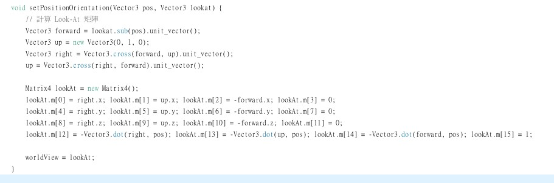
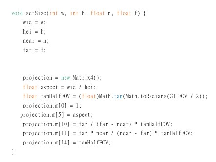
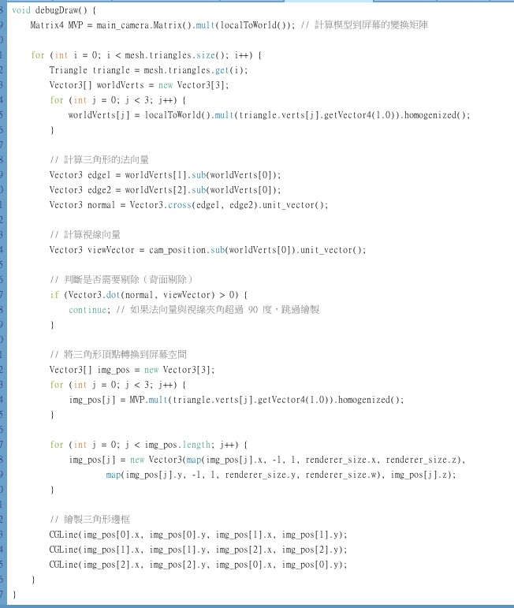

# computer-graphic_NCU

## 描述
這是一個3D小畫家，支援旋轉、平移、縮放，以及移動相機位置。

### 功能說明
Rotation Matrix (Y-axis)

Matrix4::makeRotX(float a)

Model Transformation (Model Matrix)

Camera Transformation (View Matrix)

Perspective Rendering

Depth Buffer

Camera Control

Backculling

影片

#### 補充
有使用chatgpt協助完成作業，把我打好的程式碼丟給chatgpt請他幫我修改及優化