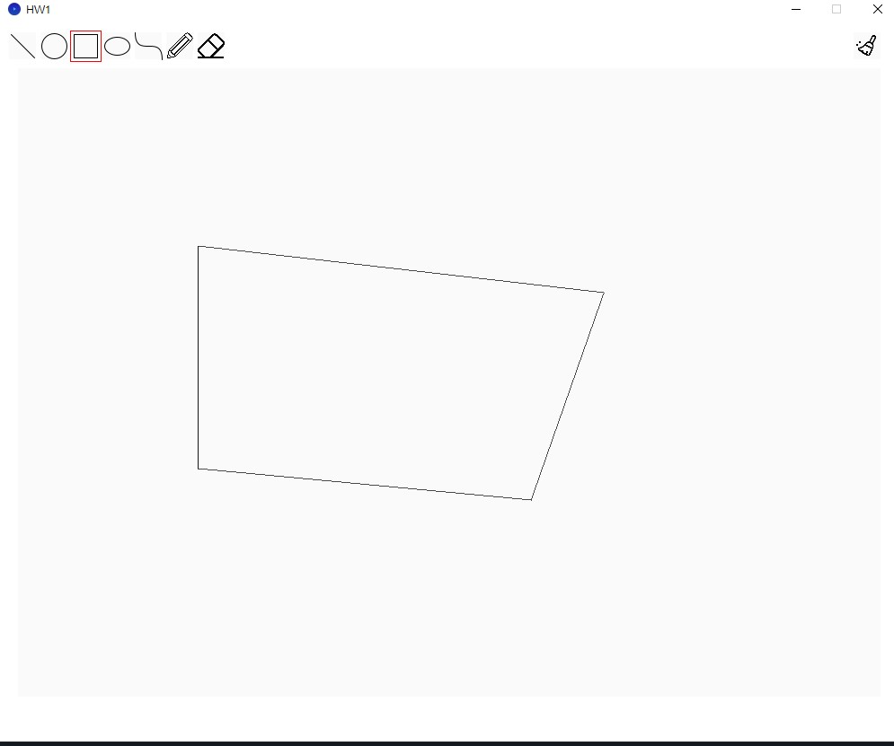
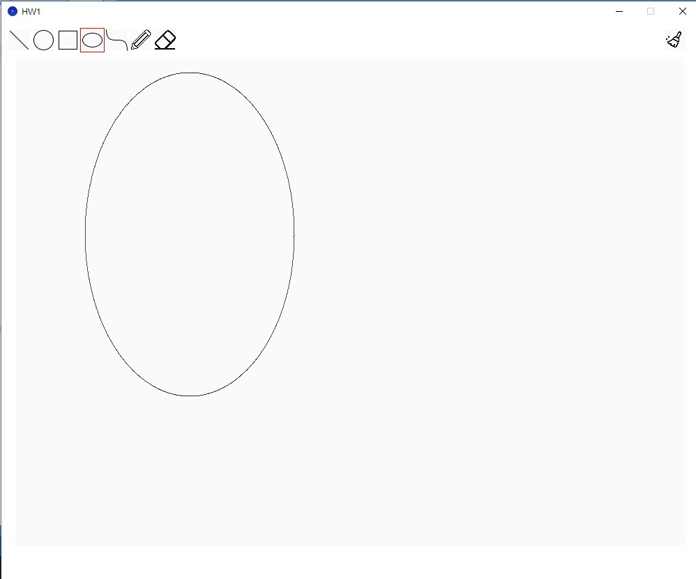
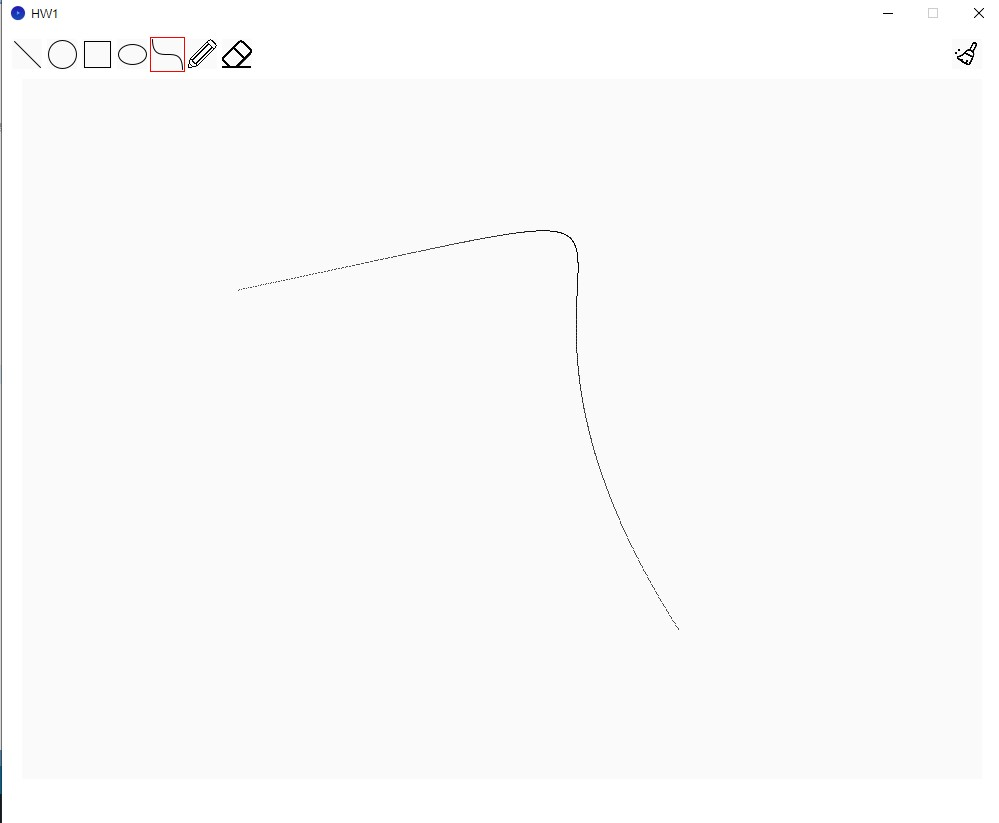
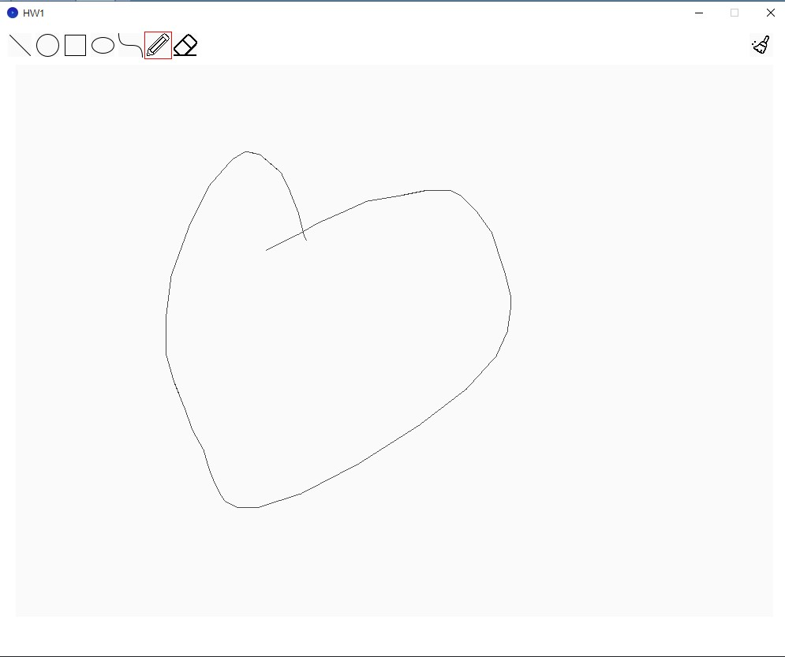

NCU_Course_HW

# Lab 1

## 描述
這是一個小畫家，可以畫直線、多邊形、圓圈、橢圓、曲線、鉛筆以及橡皮擦

### 功能說明
畫直線

畫多邊形

畫圓

畫橢圓Markdown

畫曲線

鉛筆

擦除(滾動滑鼠即可改變擦除範圍)

# Lab 2

## 描述
這是一個小畫家，可以畫直線、多邊形、圓圈、橢圓、曲線、鉛筆以及橡皮擦

### 功能說明
畫長方形

畫星星

影片示範

