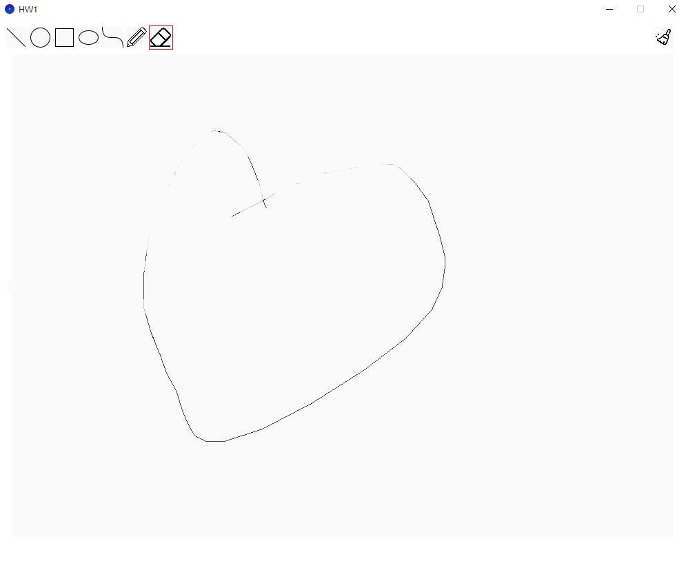

NCU_Course_HW

# Lab 1

## 描述
這是一個小畫家，可以畫直線、多邊形、圓圈、橢圓、曲線、鉛筆以及橡皮擦

### 功能說明
畫直線

畫多邊形

畫圓

畫橢圓Markdown

畫曲線

鉛筆

擦除(滾動滑鼠即可改變擦除範圍)

# Lab 2

## 描述
這是一個小畫家，可以畫直線、多邊形、圓圈、橢圓、曲線、鉛筆以及橡皮擦

### 功能說明
畫長方形

畫星星

影片示範

# Lab 3

## 描述
這是一個3D小畫家，支援旋轉、平移、縮放，以及移動相機位置。

### 功能說明
Rotation Matrix (Y-axis)

Matrix4::makeRotX(float a)

Model Transformation (Model Matrix)

Camera Transformation (View Matrix)

Perspective Rendering

Depth Buffer

Camera Control

Backculling

影片

# Lab 4

## 描述
完成三角形的Barycentric Coordinates、Flat Shading、Gouraud著色、Phong著色

### 功能說明
## 1.Barycentric Coordinates
先利用點座標算出面積，再計算alpha、beta跟gamma，然後因為要求Perspective-Correct Interpolation，所以再各除以三個點的W

## 2.Phong Shading
先以三角形頂點內插任意點的向量，再用任一點的向量計算光照後的顏色

## 3.Flat Shading
算出三角形的向量作為任意點的向量，計算光照的顏色

## 4.Gouraud Shading
算出三角形頂點的光照顏色，再去內插任意點的光照顏色

## 影片

